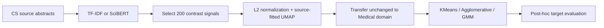

<div align="center">

# Cross-Domain SciBERT Analysis of AI-Generated Scientific Text

### Source-label-informed and target-unsupervised representation transfer

[](https://www.python.org/)
[](https://huggingface.co/allenai/scibert_scivocab_uncased)
[](https://github.com/pkhunter47)

</div>

## Overview

This project studies whether AI-versus-human writing signals learned from Computer Science abstracts transfer to Medical abstracts without using target-domain labels for fitting or adaptation. It compares sparse TF-IDF features with contextual SciBERT representations under the same transfer and clustering controls.

## Experimental design

- Source domain: 4,000 Computer Science abstracts
- Target domain: 3,990 Medical abstracts
- Total: 7,990 balanced AI-generated and human-written abstracts
- Source labels are used to select AI-minus-human contrast signals.
- Target labels are withheld until post-clustering evaluation.



## Main finding

SciBERT produced substantially stronger target-domain clustering than TF-IDF. The saved analysis reports Medical-domain KMeans:

| Metric | SciBERT result |
|---|---:|
| Purity | **0.9308** |
| Adjusted Rand Index | **0.7424** |
| Normalized Mutual Information | **0.6987** |
| Direction agreement | **0.9500** |

These results describe representation separability under a source-label-informed pipeline; they are not equivalent to end-to-end unsupervised AI-text detection.

## Repository contents

```text
cross-domain-scibert-analysis/
├── notebooks/scibert_cross_domain_analysis.ipynb
├── notebooks/scibert_transfer_pipeline.ipynb
├── notebooks/tfidf_scibert_umap_comparison.ipynb
├── requirements.txt
└── README.md
```

The canonical stepwise notebook is accompanied by two distinct experimental variants: an earlier source-to-target SciBERT pipeline and a compact TF-IDF/SciBERT/UMAP comparison. Exact duplicate uploads are intentionally represented only once.

## Reproducibility notes

- Fit vocabulary, contrast selection, normalization, and UMAP on the source domain only.
- Do not use Medical labels until final evaluation.
- Report all clustering algorithms, not only the best result.
- Preserve corpus-generation metadata and LLM provenance.
- Test robustness against different generators, disciplines, prompts, and publication periods.

## Status

This is ongoing research. The uploaded manuscript draft contained placeholder author information and was therefore not published in this repository.

## Contact

**Protik Biswas** · [GitHub](https://github.com/pkhunter47) · [LinkedIn](https://www.linkedin.com/in/protik-biswas-83001827b/)
